# Grout State Machine

This document shows the navigation flow between screens in Grout.

## Overview

```mermaid
flowchart TB
    subgraph Main["Main Navigation"]
        PS[Platform Selection]
        GL[Game List]
        GD[Game Details]
        GO[Game Options]
    end

    subgraph Collections["Collections"]
        CL[Collection List]
        CPS[Collection Platform Selection]
        CS[Collection Search]
    end

    subgraph Search["Search"]
        S[Search]
    end

    subgraph Settings["Settings"]
        SET[Settings]
        CSET[Collections Settings]
        ASET[Advanced Settings]
        SSSET[Save Sync Settings]
        PM[Platform Mapping]
        CC[Clear Cache]
        INFO[Info]
        LOGOUT[Logout Confirmation]
    end

    subgraph Actions["Actions"]
        SS[Save Sync]
        BIOS[BIOS Download]
        ART[Artwork Sync]
    end

    %% Main Navigation Flow
    PS -->|"Select Platform"| GL
    PS -->|"Collections"| CL
    PS -->|"Settings (X)"| SET
    PS -->|"Save Sync (Y)"| SS
    PS -->|"Quit"| EXIT((Exit))

    GL -->|"Select Game"| GD
    GL -->|"Search (X)"| S
    GL -->|"BIOS (Y)"| BIOS
    GL -->|"Back"| PS

    GD -->|"Download"| GL
    GD -->|"Options (X)"| GO
    GD -->|"Back"| GL

    GO -->|"Save/Back"| GD

    S -->|"Submit/Cancel"| GL

    BIOS -->|"Done"| GL

    %% Collections Flow
    CL -->|"Select Collection"| CPS
    CL -->|"Search (X)"| CS
    CL -->|"Back"| PS

    CPS -->|"Select Platform"| GL
    CPS -->|"Back"| CL

    CS -->|"Submit/Cancel"| CL

    %% Collection Game List returns
    GL -.->|"Back (from collection)"| CPS
    GL -.->|"Back (unified collection)"| CL

    %% Settings Flow
    SET -->|"Save/Back"| PS
    SET -->|"Collections Settings"| CSET
    SET -->|"Advanced Settings"| ASET
    SET -->|"Save Sync Settings"| SSSET
    SET -->|"Info"| INFO

    CSET -->|"Save/Back"| SET
    SSSET -->|"Save/Back"| SET

    ASET -->|"Save/Back"| SET
    ASET -->|"Directory Mappings"| PM
    ASET -->|"Clear Cache"| CC
    ASET -->|"Cache Artwork"| ART
    ASET -->|"Info"| INFO

    PM -->|"Save/Back"| ASET
    CC -->|"Confirm/Cancel"| ASET
    ART -->|"Done"| ASET

    INFO -->|"Back"| SET
    INFO -.->|"Back (from advanced)"| ASET
    INFO -->|"Logout"| LOGOUT

    LOGOUT -->|"Cancel"| INFO
    LOGOUT -->|"Confirm"| PS

    SS -->|"Done"| PS
```



## State Descriptions

| State | Description |
|-------|-------------|
| Platform Selection | Main menu showing available platforms and collections |
| Game List | List of games for selected platform/collection |
| Game Details | Detailed view of a single game with metadata |
| Game Options | Per-game settings (e.g., save directory) |
| Collection List | List of available collections |
| Collection Platform Selection | Platform filter within a collection |
| Search | On-screen keyboard for searching games |
| Collection Search | On-screen keyboard for searching collections |
| Settings | Main settings menu |
| Collections Settings | Collection display options |
| Advanced Settings | Advanced options (timeouts, cache, mappings) |
| Save Sync Settings | Per-platform save directory configuration |
| Platform Mapping | Configure ROM directory mappings |
| Clear Cache | Confirm cache clearing |
| Info | App info and logout option |
| Logout Confirmation | Confirm logout action |
| Save Sync | Manual save synchronization |
| BIOS Download | Download BIOS files for a platform |
| Artwork Sync | Pre-cache artwork for all games |

## Navigation State (`NavState`)

The FSM maintains navigation state in a single struct:

```go
type NavState struct {
    // Game browsing
    CurrentGames []romm.Rom
    FullGames    []romm.Rom
    SearchFilter string
    HasBIOS      bool
    GameListPos  ListPosition

    // Collections
    CollectionSearchFilter string
    CollectionGames        []romm.Rom
    CollectionListPos      ListPosition
    CollectionPlatformPos  ListPosition

    // Platforms
    PlatformListPos ListPosition

    // Settings
    SettingsPos            ListPosition
    CollectionsSettingsPos ListPosition
    AdvancedSettingsPos    ListPosition

    // Navigation flags
    QuitOnBack        bool
    ShowCollections   bool
    InfoPreviousState gaba.StateName
}
```

This struct is stored in the FSM context and accessed via `gaba.Get[*NavState](ctx)`.
